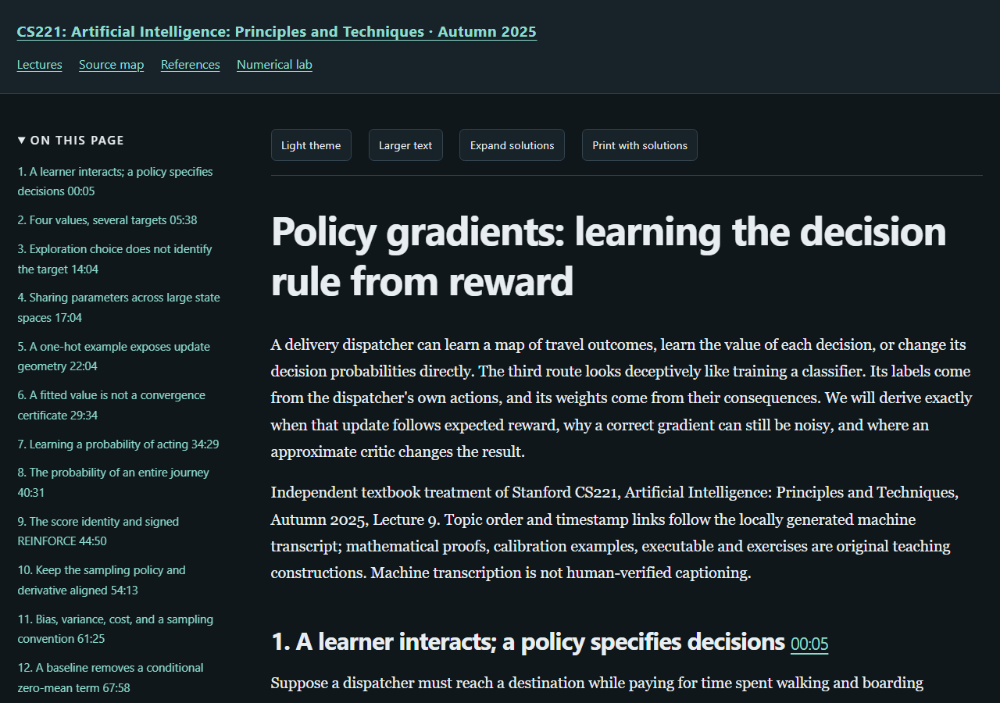

# Stanford CS221: Artificial Intelligence: Principles and Techniques, Autumn 2025

An independently written study book following twenty Stanford recordings. The course recordings determine the topic order; explanations, derivations, finite programs and worked exercises are educational additions.

[Read the online textbook](https://az9713.github.io/cs221-artificial-intelligence-principles-and-techniques-notes/) · [Source and timestamp map](https://az9713.github.io/cs221-artificial-intelligence-principles-and-techniques-notes/source-map.html) · [Primary references](https://az9713.github.io/cs221-artificial-intelligence-principles-and-techniques-notes/references.html) · [Numerical laboratory](https://az9713.github.io/cs221-artificial-intelligence-principles-and-techniques-notes/numerical-lab.html)

[Official course page](https://stanford-cs221.github.io/autumn2025/) · [Recording playlist](https://www.youtube.com/playlist?list=PLoROMvodv4rMeDqwS1yFl3j3sR_-MQNEN)

Twenty chapters contain **120 complete worked solutions**, twenty executable chapter examples and a seven-panel interactive laboratory. Topics include learning and neural networks, search, Markov decision processes, reinforcement learning, games, graphical models, logic, language models, AI and society, supply chains and research decisions.

[](https://az9713.github.io/cs221-artificial-intelligence-principles-and-techniques-notes/)

## Read the chapters online

| Book chapter | Live chapter | Stanford recording |
|---:|---|---|
| 1 | [Intelligent agents, historical ideas, and executable tensors](https://az9713.github.io/cs221-artificial-intelligence-principles-and-techniques-notes/lecture-01-foundations-and-tensors.html) | [Recording 1](https://www.youtube.com/watch?v=yaLEGZuIIgE) |
| 2 | [Objectives, gradients, and learning](https://az9713.github.io/cs221-artificial-intelligence-principles-and-techniques-notes/lecture-02-objectives-gradients-and-learning.html) | [Recording 2](https://www.youtube.com/watch?v=ypZJaTqrNdk) |
| 3 | [Classification, probabilities, and the information retained by text](https://az9713.github.io/cs221-artificial-intelligence-principles-and-techniques-notes/lecture-03-classification-probabilities-and-text.html) | [Recording 3](https://www.youtube.com/watch?v=Mbe5ICIUw5Q) |
| 4 | [Neural networks: representation, differentiation, and stable training](https://az9713.github.io/cs221-artificial-intelligence-principles-and-techniques-notes/lecture-04-neural-networks-and-training.html) | [Recording 4](https://www.youtube.com/watch?v=89NND-Ca0yY) |
| 5 | [Search problems, reusable futures, and approximate planning](https://az9713.github.io/cs221-artificial-intelligence-principles-and-techniques-notes/lecture-05-search-problems-and-approximate-planning.html) | [Recording 5](https://www.youtube.com/watch?v=fPESauMaJYA) |
| 6 | [Uniform-cost and A* search: when a promising route is provably best](https://az9713.github.io/cs221-artificial-intelligence-principles-and-techniques-notes/lecture-06-uniform-cost-and-a-star-search.html) | [Recording 6](https://www.youtube.com/watch?v=4Iu4KPVbnAY) |
| 7 | [Markov decision processes](https://az9713.github.io/cs221-artificial-intelligence-principles-and-techniques-notes/lecture-07-markov-decision-processes.html) | [Recording 7](https://www.youtube.com/watch?v=2ZtF1j3n6XE) |
| 8 | [Reinforcement learning](https://az9713.github.io/cs221-artificial-intelligence-principles-and-techniques-notes/lecture-08-reinforcement-learning.html) | [Recording 8](https://www.youtube.com/watch?v=34Hk2v2kwg4) |
| 9 | [Policy gradients: learning the decision rule from reward](https://az9713.github.io/cs221-artificial-intelligence-principles-and-techniques-notes/lecture-09-policy-gradients-and-function-approximation.html) | [Recording 9](https://www.youtube.com/watch?v=lOMNskWVeD8) |
| 10 | [Games: opponent models and search](https://az9713.github.io/cs221-artificial-intelligence-principles-and-techniques-notes/lecture-10-games-opponent-models-and-search.html) | [Recording 10](https://www.youtube.com/watch?v=SMOD_GiRzb8) |
| 11 | [Learning game values and reasoning about simultaneous decisions](https://az9713.github.io/cs221-artificial-intelligence-principles-and-techniques-notes/lecture-11-learning-game-values-and-simultaneous-decisions.html) | [Recording 11](https://www.youtube.com/watch?v=9CKRoKFdS5Y) |
| 12 | [Bayesian networks: building a joint model and reasoning from evidence](https://az9713.github.io/cs221-artificial-intelligence-principles-and-techniques-notes/lecture-12-bayesian-networks-and-probabilistic-inference.html) | [Recording 12](https://www.youtube.com/watch?v=ec2rCf4iIqU) |
| 13 | [Conditional inference and Gibbs sampling](https://az9713.github.io/cs221-artificial-intelligence-principles-and-techniques-notes/lecture-13-conditional-inference-and-gibbs-sampling.html) | [Recording 13](https://www.youtube.com/watch?v=Dk7Kqqehzjk) |
| 14 | [Learning with hidden variables and expectation maximization](https://az9713.github.io/cs221-artificial-intelligence-principles-and-techniques-notes/lecture-14-learning-with-hidden-variables-and-expectation-maximization.html) | [Recording 14](https://www.youtube.com/watch?v=4d9V6Sxa6gU) |
| 15 | [Propositional logic: assumptions, witnesses and justified answers](https://az9713.github.io/cs221-artificial-intelligence-principles-and-techniques-notes/lecture-15-propositional-logic-and-justified-answers.html) | [Recording 15](https://www.youtube.com/watch?v=Q7V13XriJEc) |
| 16 | [First-order logic and structured inference](https://az9713.github.io/cs221-artificial-intelligence-principles-and-techniques-notes/lecture-16-first-order-logic-and-structured-inference.html) | [Recording 16](https://www.youtube.com/watch?v=x9Mbqu06OVo) |
| 17 | [Language models and sequence generation](https://az9713.github.io/cs221-artificial-intelligence-principles-and-techniques-notes/lecture-17-language-models-and-sequence-generation.html) | [Recording 17](https://www.youtube.com/watch?v=3orP3u2-jcg) |
| 18 | [AI and society: choosing objectives, auditing evidence and governing a release](https://az9713.github.io/cs221-artificial-intelligence-principles-and-techniques-notes/lecture-18-ai-society-objectives-audits-and-release.html) | [Recording 18](https://www.youtube.com/watch?v=071zJXhvNfM) |
| 19 | [AI supply chains: from a capable model to economic value](https://az9713.github.io/cs221-artificial-intelligence-principles-and-techniques-notes/lecture-19-ai-supply-chains-and-economic-value.html) | [Recording 19](https://www.youtube.com/watch?v=lPx5PF1ttkc) |
| 20 | [Research after the course: choose a question, design evidence, revise a decision](https://az9713.github.io/cs221-artificial-intelligence-principles-and-techniques-notes/lecture-20-research-decisions-and-evidence.html) | [Recording 20](https://www.youtube.com/watch?v=5u5I5jvWR5k) |

## What the book adds

Each chapter develops assumptions, notation, derivations, interpretations, limitations and original exercises around its recording. Timestamp links locate the related discussion. A prerequisite map and ordered learning route connect the chapters. The source map distinguishes lecture material, primary research and original teaching constructions; research claims retain their source versions and experimental conditions.

The interactive laboratory explores learning, planning, games, inference, logic, societal decisions and information value. Its exact finite models are available in `programs/course_lab.py`; browser arithmetic is approximate. These are teaching constructions, not large-model benchmarks or deployment guarantees.

## Validation and remaining limits

All twenty chapters and the book-wide manuscript passed independent scientific/editorial review with zero blocking defects in the recorded scope. Local validation passed 48 desktop/mobile viewport checks, 319 local links, 271 timestamps, 25 Python listings and execution of all twenty chapter programs. All 2,125 authored paragraphs are preserved in the rendered text at each tested width. Validation records identify the actual scope and artifact hashes:

- [Validation summary](validation-summary.json)
- [Reader checks](reader-validation.json)
- [Reading-edition completion scope](completion.json)

The human keyboard and screen-reader audit remains unperformed. Full accessibility certification remains pending; publication does not imply that this check was performed.

Transcript hashes and timing checks establish file identity and valid intervals, not human-verified speech recognition. Transcripts use local automatic speech recognition rather than publisher-authored captions. The finite programs do not reproduce neural-scale, GPU or robot benchmarks. Speaker opinions, reported experiments, conditional formal results and original examples retain distinct evidence grades.

## Attribution and source boundaries

This is an independent educational contribution, not an official Stanford publication or endorsement. Stanford supplies the course recordings and intellectual context; cited research is attributed to its original creators. The exercises and programs are original teaching work, not Stanford assignment answer keys. This repository links to recordings and papers. Raw media, machine transcripts, acquired papers/decks, private acquisition logs and editorial working files are excluded.

## Use locally

Download this repository and open `index.html`, or serve the directory with `python -m http.server 8000 --bind 127.0.0.1`. The bundled reader and mathematics work offline; external recording and research links require internet access.

Chapter 1's checks run with `python numerical_lab.py`; optional NumPy checks run when NumPy is installed. Chapters 02–20 have standard-library programs in `programs/chapterNN.py`. The interactive laboratory's standard-library exact models are in `programs/course_lab.py`.

```sh
python numerical_lab.py
python programs/chapter20.py
```

GitHub Pages serves the `main` branch root. `.nojekyll` keeps this a static HTML package. The bundled MathJax license is in `assets/mathjax-LICENSE`.
